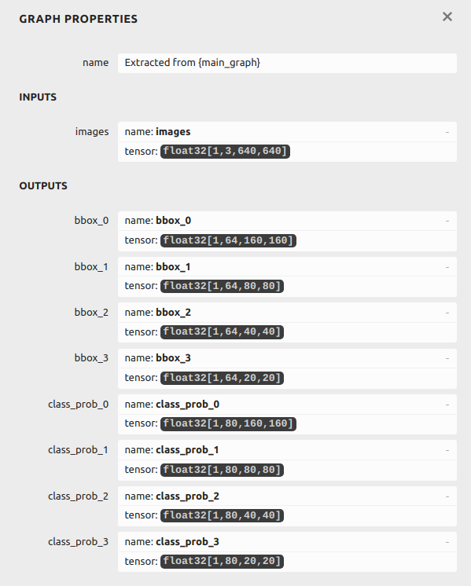
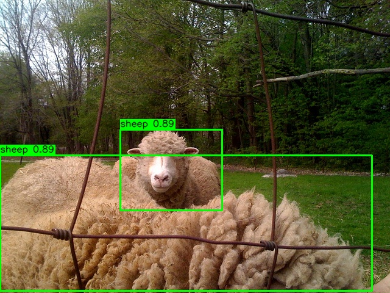

# YoloV8x_p2 Object Detection #

# WORK IN PROGRESS! #

### Add a section here for required environment, tools, etc ###


This tutorial demonstrates the following steps:

  * Running a trained FP32 ONNX model to provide baseline results.
  * Loading, Quantizing and Compiling of the trained FP32 model.
  * Evaluation of the quantized model.
  * Benchmarking of the compiled model.
  * Executing a compiled model on a hardware platform.
  * Building a GStreamer pipeline with USB camera input.


YOLOv8x uses three detection heads on feature maps P3, P4, P5, corresponding to strides 8, 16 and 32 (so for a 640×640 input you get 80×80, 40×40, 20×20 grids). The p2 variant modifies the architecture so that the detector outputs from P2–P5 instead of P3–P5:

* P2 head (new) – stride 4, feature map 160×160 for 640×640 input
* P3 head – stride 8 (80×80)
* P4 head – stride 16 (40×40)
* P5 head – stride 32 (20×20)

Architecturally this is done by extending the neck: additional upsampling and concat operations pull higher-resolution features (P2) from the backbone, process them with C2f blocks, and then feed a 4-scale Detect head: Detect(P2, P3, P4, P5). The P2 head operates on a higher-resolution feature map (stride 4), so bounding boxes for tiny objects (e.g. 5–15 px in one dimension) can be anchored to more precise cell centers.

The p2 variant is suited to high-resolution, cluttered scenes or large images with many tiny objects (UAV imagery, drones, traffic signs at distance, insects, cells, PCB components, etc.). 


The disadvantages are generally slower inference and higher memory usage. Also, the labelling of small objects can sometimes be error-prone, if the small-object annotations in the training dataset are noisy or inconsistent, the P2 head will overfit that noise. which leads to higher false positives on cluttered backgrounds unless you tune augmentations and losses carefully.


## Starting the Palette SDK docker container ##

The docker container can be started using `sima-cli sdk start` from the command line. Follow the instructions to select and start the eLxr, ModelSDK and MPK containers:

```shell
user@ubmsh2:~/projects/yolov8x_p2$ sima-cli sdk start
✅ sima-cli is up-to-date
🔧 Environment: host (linux)
🖥️  Detected platform: Linux
✅ Docker daemon is running.
╭───────────────── 📘 SiMa.ai SDK Image Selection ──────────────────╮
│ How to use this menu:                                             │
│                                                                   │
│ • Use ↑/↓ arrows then Space to select one or more images.         │
│ • Press Enter to confirm your selection.                          │
│ • These are local Docker images found containing 'sima-docker'.   │
│ • Containers based on these images will be started automatically. │
│ • Press CTRL+C to cancel anytime.                                 │
╰───────────────────────────────────────────────────────────────────╯
Single SDK version detected: 2.0.0_Palette_SDK_master_B240
📦 Select SDK images to start: (Space to toggle, Enter to confirm) 
  ◉ ✅ Select All
  ◉ vdp-cli-elxr-2.0.0_palette_sdk_master_b240
  ◉ vdp-cli-modelsdk-2.0.0_palette_sdk_master_b240
❯ ◉ vdp-cli-mpk_cli_toolset-2.0.0_palette_sdk_master_b240
  ○ vdp-cli-yocto-2.0.0_palette_sdk_master_b240
  ○ 🚫 Cancel
```

When asked to enter the the workspace directory, just respond with `./`


Access the ModelSDK container with `sima-cli sdk model`:

```shell
user@ubmsh2:~/projects/yolov8x_p2$ sima-cli sdk model
✅ sima-cli is up-to-date
🔧 Environment: host (linux)
🖥️  Detected platform: Linux
✅ Docker daemon is running.
▶ Executing command in container: vdp-cli-modelsdk-2.0.0_palette_sdk_master_b240
=============================================================
 🚀 Welcome to the ModelSDK Container 
 
 ⚠️  IMPORTANT NOTICE:
 Please keep all your work in the mounted path:
     /home/docker/sima-cli 
 to avoid losing files if the container is removed accidentally.
=============================================================
user@vdp-cli-modelsdk-2:/home/docker/sima-cli$ 
```


Now unzip the calibration and test image samples:


```shell
unzip calib_images.zip
unzip test_images.zip
```


## Converting the PyTorch model to ONNX ##

The starting point will be a trained ONNX model - the model file (yolov8x-p2.onnx) is provided from [Google Drive](https://drive.google.com/file/d/1rFa923GeVE91kRmxRZpWEzurWC2V5COV/view?usp=sharing) or the trained PyTorch model (model.pt) can be downloaded from its original [source repository](https://huggingface.co/davsolai/yolov8x-p2-coco).

If you use the PyTorch model, it will need to be converted to ONNX format:

```shell
pip install ultralytics
python export2onnx.py
```


## Execute The Original Floating-Point ONNX model ##

ONNXRuntime is included in the SDK docker, so we can run the floating-point model. This is useful to provide a baseline for comparing to the post-quantization and post-compile models. The run_onnx.py script includes pre- and postprocessing.

> Note: The same pre-processing and post-processing is used at every step and will generally be similar to the pre/post-processing used during model training.
> The pre-processing used in this Yolov8x_p2 example is resizing and padding to the model input size (usually 640,640) conversion from BGR to RGB format, pixel value normalization to the range 0->1s


```shell
python run_onnx_single_out.py 
```


The expected console output is like this:

```shell
user@vdp-cli-modelsdk-2:/home/docker/sima-cli$ python run_onnx_single_out.py 

--------------------------------------------------
3.10.12 (main, Nov  4 2025, 08:48:33) [GCC 11.4.0]
--------------------------------------------------
Found 10 image(s) in './test_images'
Output images will be written to './build/onnx_pred'
Processing image: 000000006894.jpg
  Detections: 2
  Annotated image written to: ./build/onnx_pred/000000006894.jpg
Processing image: 000000019221.jpg
  Detections: 2
  Annotated image written to: ./build/onnx_pred/000000019221.jpg
Processing image: 000000022589.jpg
  Detections: 2
  Annotated image written to: ./build/onnx_pred/000000022589.jpg
Processing image: 000000032941.jpg
  Detections: 12
  Annotated image written to: ./build/onnx_pred/000000032941.jpg
Processing image: 000000048504.jpg
  Detections: 4
  Annotated image written to: ./build/onnx_pred/000000048504.jpg
Processing image: 000000572408.jpg
  Detections: 4
  Annotated image written to: ./build/onnx_pred/000000572408.jpg
Processing image: 000000573626.jpg
  Detections: 1
  Annotated image written to: ./build/onnx_pred/000000573626.jpg
Processing image: 000000574520.jpg
  Detections: 2
  Annotated image written to: ./build/onnx_pred/000000574520.jpg
Processing image: 000000577735.jpg
  Detections: 2
  Annotated image written to: ./build/onnx_pred/000000577735.jpg
Processing image: 000000581062.jpg
  Detections: 2
  Annotated image written to: ./build/onnx_pred/000000581062.jpg
```

Images annotated with bounding boxes are written into the ./build/onnx_pred folder.


## Graph Surgery ##

The original ONNX model will not be fully implemented on the MLA so some graph surgery is required:


```shell
python rewrite_yolov8mp2_4_outs.py yolov8x-p2.onnx
```


This generates a new ONNX model called 'yolov8x-p2_opt_4o.onnx' which has 4 output pairs:




## Execute The Modified Floating-Point ONNX model ##

```shell
python run_onnx_4_outs.py
```


Images annotated with bounding boxes are written into the ./build/onnx_4_pred folder.





## Quantize & Compile ##

The run_modelsdk.py script will do the following:

* load the floating-point ONNX model.
* quantize using pre-processed calibration data and quantization parameters set using command line arguments.
* test the quantized model accuracy using pre-processed images. Annotated images are written to build/quant_pred
* compile and then untar to extract the .elf and .json files (for use in benchmarking on the target board)

*Note: the quantization is done using min-max calibration method instead of the default mse method.*


```shell
python run_modelsdk.py -e
```

The images are written into build/quant_pred folder:


The expected console output is like this:

```shell
user@modelsdk:/home/docker/sima-cli$ python run_modelsdk.py -e

--------------------------------------------------
Model SDK version 2.0.0
3.10.12 (main, Nov  4 2025, 08:48:33) [GCC 11.4.0]
--------------------------------------------------
Results will be written to /home/docker/sima-cli/build/yolov8x-p2_opt_4o
--------------------------------------------------
Model Inputs:
images: (1, 3, 640, 640)
--------------------------------------------------
2025-11-19 03:04:09,940 - afe.apis.loaded_net - INFO - Loading ['yolov8x-p2_opt_4o.onnx'] in onnx format
Loaded model from yolov8x-p2_opt_4o.onnx
Quantizing with 1 calibration samples
2025-11-19 03:04:21,165 - afe.apis.loaded_net - INFO - Quantize loaded net, layout = NCHW, arm_only = False
2025-11-19 03:04:21,165 - afe.apis.loaded_net - INFO - Calibration method = min_max
2025-11-19 03:05:59,219 - afe.ir.transform.calibration_transforms - INFO - Running Calibration ...
Calibration Progress: |██████████████████████████████| 100.0% 1|1 Complete.  1/1
Running Calibration ...DONE
Running quantization ...DONE
Quantized model saved to /home/docker/sima-cli/build/yolov8x-p2_opt_4o/yolov8x-p2_opt_4o.sima.json
Annotated images will be written to /home/docker/sima-cli/build/quant_pred
Using 10 out of 10  test images
Processing image: 000000006894.jpg
  Detections: 2
  Annotated image written to: /home/docker/sima-cli/build/quant_pred/000000006894.jpg
Processing image: 000000019221.jpg
  Detections: 2
  Annotated image written to: /home/docker/sima-cli/build/quant_pred/000000019221.jpg
Processing image: 000000022589.jpg
  Detections: 2
  Annotated image written to: /home/docker/sima-cli/build/quant_pred/000000022589.jpg
Processing image: 000000032941.jpg
  Detections: 12
  Annotated image written to: /home/docker/sima-cli/build/quant_pred/000000032941.jpg
Processing image: 000000048504.jpg
  Detections: 4
  Annotated image written to: /home/docker/sima-cli/build/quant_pred/000000048504.jpg
Processing image: 000000572408.jpg
  Detections: 4
  Annotated image written to: /home/docker/sima-cli/build/quant_pred/000000572408.jpg
Processing image: 000000573626.jpg
  Detections: 1
  Annotated image written to: /home/docker/sima-cli/build/quant_pred/000000573626.jpg
Processing image: 000000574520.jpg
  Detections: 2
  Annotated image written to: /home/docker/sima-cli/build/quant_pred/000000574520.jpg
Processing image: 000000577735.jpg
  Detections: 2
  Annotated image written to: /home/docker/sima-cli/build/quant_pred/000000577735.jpg
Processing image: 000000581062.jpg
  Detections: 2
  Annotated image written to: /home/docker/sima-cli/build/quant_pred/000000581062.jpg
Compiling with batch size set to 1
Wrote compiled model to /home/docker/sima-cli/build/yolov8x-p2_opt_4o/yolov8x-p2_opt_4o_mpk.tar.gz
```


The evaluation of the quantized model generates images annotated with bounding boxes and are written into the ./build/quant_pred folder.


## Test model on hardware ##

Run the model directly on the target board. This requires the target board to be reachable via ssh. Make sure to set the IP address of the target board:


```shell
python run_accelmode.py -hn <target_ip_address>
```

Note: This will take some time to run as it compiles the quantized model from scratch.


The output in the console will be something like this:


```shell
user@modelsdk88084ef7e7b:/home/docker/sima-cli$ python run_accelmode.py -hn 192.168.1.25

--------------------------------------------------
Model SDK version 2.0.0
3.10.12 (main, Nov  4 2025, 08:48:33) [GCC 11.4.0]
--------------------------------------------------
Annotated images will be written to /home/docker/sima-cli/build/accel_pred
Loading yolov8x-p2_opt_4o quantized model from build/yolov8x-p2_opt_4o
Using 10 out of 10  test images
Processing image: 000000031534.jpg
Processing image: 000000054338.jpg
Processing image: 000000087711.jpg
Processing image: 000000172700.jpg
Processing image: 000000221207.jpg
Processing image: 000000366228.jpg
Processing image: 000000390786.jpg
Processing image: 000000391007.jpg
Processing image: 000000488779.jpg
Processing image: 000000546225.jpg
Compiling model yolov8x-p2_opt_4o to .elf file
Creating the Forwarding from host
Copying the model files to DevKit
Creating the Forwarding from host
ZMQ Connection successful.
Executing model graph in accelerator mode:
  Detections: 6
  Annotated image written to: /home/docker/sima-cli/build/accel_pred/000000031534.jpg
  Detections: 2
  Annotated image written to: /home/docker/sima-cli/build/accel_pred/000000054338.jpg
  Detections: 3
  Annotated image written to: /home/docker/sima-cli/build/accel_pred/000000087711.jpg
  Detections: 1
  Annotated image written to: /home/docker/sima-cli/build/accel_pred/000000172700.jpg
  Detections: 1
  Annotated image written to: /home/docker/sima-cli/build/accel_pred/000000221207.jpg
  Detections: 2
  Annotated image written to: /home/docker/sima-cli/build/accel_pred/000000366228.jpg
  Detections: 4
  Annotated image written to: /home/docker/sima-cli/build/accel_pred/000000390786.jpg
  Detections: 2
  Annotated image written to: /home/docker/sima-cli/build/accel_pred/000000391007.jpg
  Detections: 2
  Annotated image written to: /home/docker/sima-cli/build/accel_pred/000000488779.jpg
  Detections: 6
  Annotated image written to: /home/docker/sima-cli/build/accel_pred/000000546225.jpg
```


The evaluation of the compiled model generates images annotated with bounding boxes and are written into the ./build/accel_pred folder.


## Benchmarking model on hardware ##

The model can be benchmarked on the target board. This uses random data to test the throughput - note that this only tests the MLA throughput, it does not include pre and post-processing.


```shell
python ./get_fps/network_eval/network_eval.py \
    --model_file_path   ./build/yolov8x-p2_opt_4o/benchmark/yolov8x-p2_opt_4o_stage1_mla.elf \
    --mpk_json_path     ./build/yolov8x-p2_opt_4o/benchmark/yolov8x-p2_opt_4o_mpk.json \
    --dv_host           <target_ip_address> \
    --image_size        640 640 3 \
    --verbose \
    --bypass_tunnel \
    --max_frames        100 \
    --batch_size        1
```

  The measured throughput in frames per second (FPS) will be printed in the console:

```shell
Running model in MLA-only mode
Copying the model files to DevKit
sima@192.168.1.21's password: 
FPS = 108
FPS = 109
FPS = 109
FPS = 109
FPS = 109
FPS = 109
FPS = 109
FPS = 109
FPS = 109
FPS = 109
Ran 100 frame(s)
```


## Building the GStreamer Pipeline ##

Make sample images that can be used with the simaaisrc plugin:

```shell
python make_samples.py
```


Now exit out of the ModelSDK container:


```shell
user@vdp-cli-modelsdk-2:/home/docker/sima-cli$ exit
```


.. and access the MPK container:

```shell
sima-cli sdk mpk
```


Make the baseline pipeline:

```shell
mpk project create --model-path ./build/yolov8x-p2_opt_4o/yolov8x-p2_opt_4o_mpk.tar.gz --src-plugin simaaisrc --input-resource ./build/samples_640/img%d.rgb --input-width 640 --input-height 640 --input-img-type RGB
```


### Add the Python custom plugin ###


Modify .project/pluginsInfo.json to add a new plugin called 'yolov8xp2_postproc_overlay':


```json
{
    "pluginsInfo": [
        {
            "gid": "simaaisrc",
            "path": "plugins/simaaisrc"
        },
        {
            "gid": "processcvu",
            "path": "plugins/processcvu"
        },
        {
            "gid": "processmla",
            "path": "plugins/processmla"
        },
        {
            "gid" : "yolov8xp2_postproc_overlay",
            "path" : "plugins/yolov8xp2_postproc_overlay"
        }
    ]
}
```


Add a folder to contain the custom Python plugin and copy the templates into it:

```shell
mkdir -p ./yolov8x-p2_opt_4o_mpk_simaaisrc/plugins/yolov8xp2_postproc_overlay
cp /usr/local/simaai/plugin_zoo/gst-simaai-plugins-base/gst/templates/aggregator_python/python/*.py ./yolov8x-p2_opt_4o_mpk_simaaisrc/plugins/yolov8xp2_postproc_overlay/.
```


Copy the contents of the 'payload_contents.py' file into ../yolov8x-p2_opt_4o_mpk_simaaisrc/plugins/yolov8xp2_postproc_overlay/payload.py

```shell
cp payload_contents.py ./yolov8x-p2_opt_4o_mpk_simaaisrc/plugins/yolov8xp2_postproc_overlay/payload.py
```

Copy the 'utils.py' file into ../yolov8x-p2_opt_4o_mpk_simaaisrc/plugins/yolov8xp2_postproc_overlay

```shell
cp utils.py ./yolov8x-p2_opt_4o_mpk_simaaisrc/plugins/yolov8xp2_postproc_overlay/.
```


Open 'application.json' and add the following into the "plugins" section of the JSON file:

```shell
    {
      "name": "simaai_yolov8xp2_postproc_overlay",
      "pluginGid": "yolov8xp2_postproc_overlay",
      "sequence" : 5
    }
```


Modify the 'gst' string and save the file:


```shell
    "gst": "simaaisrc location=/data/simaai/applications/yolov8x-p2_opt_4o_mpk_simaaisrc/etc/img%d.rgb node-name=decoder delay=1000 mem-target=1 index=1 loop=true ! 'video/x-raw, format=(string)RGB, width=(int)640, height=(int)640' ! tee name=source ! queue2 ! simaaiprocesscvu  name=simaaiprocesspreproc_1 ! simaaiprocessmla  name=simaaiprocessmla_1 ! simaaiprocesscvu  name=simaaiprocessdetess_dequant_1 ! yolov8xp2_postproc_overlay  name='simaai_yolov8xp2_postproc_overlay' ! 'video/x-raw, format=(string)RGB, width=(int)640, height=(int)640' ! fakesink source. ! queue2 ! simaai_yolov8xp2_postproc_overlay. "
```


Compile the pipeline:

```shell
mpk create --clean --board-type modalix -d ./yolov8x-p2_opt_4o_mpk_simaaisrc -s ./yolov8x-p2_opt_4o_mpk_simaaisrc
```

Connect to the target board (target board must be connected to host via ethernet):

```shell
mpk device connect -d devkit -u sima -p edgeai -t <target_ip_address>
```


Deploy the pipeline:

```shell
mpk deploy -f ./yolov8x-p2_opt_4o_mpk_simaaisrc/project.mpk -d devkit -t <target_ip_address>
```


The pipeline can be killed and removed from the target board like this:

```shell
mpk remove -t <target_ip_address> -d devkit -a ai.sima.yolov8x-p2_opt_4o_mpk_simaaisrc
```


## Example Pipelines ##

There are a number of example pipelines based on the YoloV8x_p2 model:


### pipeline1 ###

Uses the simaaisrc plugin to drive image files into the pipeline. The image files are in RGB format (created by make_samples.py) and have dimensions of 640 x 640 x 3 to match the YoloV8 model input. There is a custom Python plugin (yolov8xp2_postproc_overlay) which is responsible for decoding the model output, overlaying the boxes onto the original image and then wrting the images as PNG files into the /tmp folder on the target board.


```shell
mpk create --clean --board-type modalix -d ./pipeline1 -s ./pipeline1
mpk device connect -d devkit -u sima -p edgeai -t <target_ip_address>
mpk deploy -f ./pipeline1/project.mpk -d devkit -t <target_ip_address>
mpk remove -t <target_ip_address> -d devkit -a ai.sima.pipeline1
```


### pipeline3 ###

Uses the simaaisrc plugin to drive image files into the pipeline. The image files are in NV12 format (created by make_samples.py) and have dimensions of 1280 x 720 and are resized to 640 x 640 and converted to RGB by the preprocessing to match the YoloV8 model input. The box decoding and NMS is done by the boxdecoder plugig. The overlay plugin is responsible for annotating the bounding boxes onto the original image. There is a custom Python plugin (yolov8xp2_postproc_overlay) which is responsible for writing the annotated images as PNG files into the /tmp folder on the target board.


```shell
mpk create --clean --board-type modalix -d ./pipeline3 -s ./pipeline3
mpk device connect -d devkit -u sima -p edgeai -t <target_ip_address>
mpk deploy -f ./pipeline3/project.mpk -d devkit -t <target_ip_address>
mpk remove -t <target_ip_address> -d devkit -a ai.sima.pipeline3
```


### pipeline4 ###

Uses the simaaisrc plugin to drive image files into the pipeline. The image files are in NV12 format (created by make_samples.py) and have dimensions of 1280 x 720 and are resized to 640 x 640 and converted to RGB by the preprocessing to match the YoloV8 model input. The box decoding and NMS is done by the boxdecoder plugig. The overlay plugin is responsible for annotating the bounding boxes onto the original image. There is a custom Python plugin (yolov8xp2_postproc_overlay) which is responsible for writing the annotated images as PNG files into the /tmp folder on the target board. Frames with annotated boxes are H.264 encoded with the on-chip encoder then passed out via UDP. The user must modify the host IP address and port number in the application.json file before compiling.


```shell
mpk create --clean --board-type modalix -d ./pipeline4 -s ./pipeline4
mpk device connect -d devkit -u sima -p edgeai -t <target_ip_address>
mpk deploy -f ./pipeline4/project.mpk -d devkit -t <target_ip_address>
mpk remove -t <target_ip_address> -d devkit -a ai.sima.pipeline4
```


### pipeline5 ###

Uses the filesrc plugin to drive an 1280x720 .mp4 video file into the pipeline. The frames are decoded by the on-chip decoder then resized to 640 x 640 and converted to RGB by the preprocessing to match the YoloV8 model input. The box decoding and NMS is done by the boxdecoder plugig. The overlay plugin is responsible for annotating the bounding boxes onto the original image. Frames with annotated boxes are H.264 encoded with the on-chip encoder then passed out via UDP. The user must modify the host IP address and port number in the application.json file before compiling.


```shell
mpk create --clean --board-type modalix -d ./pipeline5 -s ./pipeline5
mpk device connect -d devkit -u sima -p edgeai -t <target_ip_address>
mpk deploy -f ./pipeline5/project.mpk -d devkit -t <target_ip_address>
mpk remove -t <target_ip_address> -d devkit -a ai.sima.pipeline5
```


### pipeline6 ###

Uses the rtspsrc plugin to drive RTSP stream into the pipeline. The frames are decoded by the on-chip decoder then resized to 640 x 640 and converted to RGB by the preprocessing to match the YoloV8 model input. The box decoding and NMS is done by the boxdecoder plugig. The overlay plugin is responsible for annotating the bounding boxes onto the original image. Frames with annotated boxes are H.264 encoded with the on-chip encoder then passed out via UDP. The user must modify the RTSP URL, host IP address and port number in the application.json file before compiling.


```shell
mpk create --clean --board-type modalix -d ./pipeline6 -s ./pipeline6
mpk device connect -d devkit -u sima -p edgeai -t <target_ip_address>
mpk deploy -f ./pipeline6/project.mpk -d devkit -t <target_ip_address>
mpk remove -t <target_ip_address> -d devkit -a ai.sima.pipeline6
```


## Files & Folders

* rewrite_yolov8mp2_4_outs.py - graph surgery script
* yolo_model.py - graph surgery utilities
* run_onnx_single_output.py - executes and evaluates the single output floating-point ONNX model
* run_onnx_4_outs.py - executes and evaluates the post-surgery floating-point ONNX model
* run_modelsdk.py - quantizes & compiles, optionally evaluates the quantized model
* run_accelmode.py - executes the model in hardware
* utils.py - common utilities functions
* get_fps - scripts for benchmarking
* calib_images.zip - images for calibration
* test_images.zip - images for testing
* make_samples.py - make sample files for use with simaaisrc plugin
* utils.py - utilities & helper functions
* pipeline1 to pipeline6 - example pipelines

## Acknowledgements

* 'davsolai' on HuggingFace for the trained PyTorch model
* Kristina Stevanovic of Sima Technologies for the graph surgery code.


